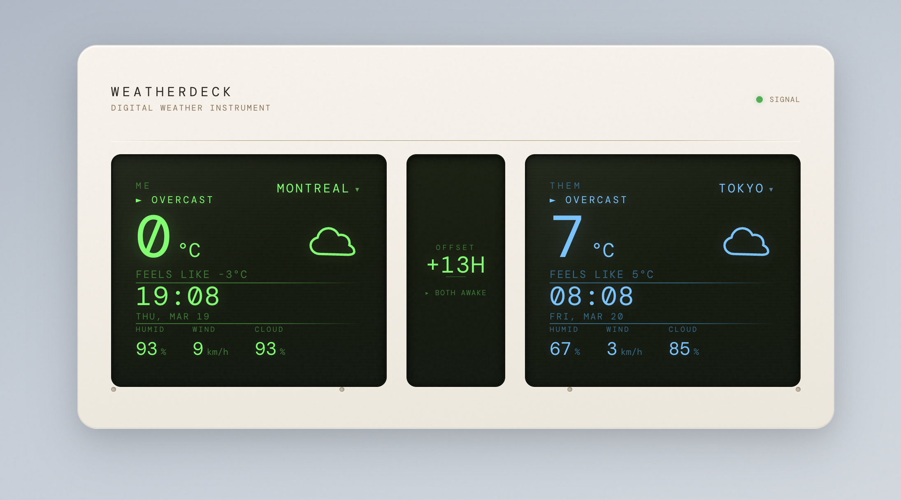

# WeatherDeck



**[Live Demo →](https://weatherdeck.b0th.com)** 🌡️

A Braun-inspired digital weather instrument. Real weather data displayed through a skeuomorphic interface that feels like a real Dieter Rams instrument sitting on your desk.


## What is this?

WeatherDeck takes the boring act of checking the weather and turns it into something tactile. Rotate the tuning knob to switch between 8 world cities. Watch the phosphor-green LCD light up with live data from Open-Meteo. Feel the elastic snap of the GSAP-animated knob.

**This is not another weather card with a cloud icon.**

## Features

- **Braun-style panel** — CSS-only skeuomorphic design (box-shadow, gradients, no Canvas)
- **Rotary knob** — Click to cycle cities, scroll wheel supported, GSAP elastic animation
- **LCD display** — Share Tech Mono font, phosphor green on dark olive, scanline overlay
- **Live weather data** — Open-Meteo API (free, no key), server-side proxy with 10-min cache
- **Dynamic backgrounds** — Gradient shifts based on weather (sunny/cloudy/rain/snow/storm)
- **Data readouts** — Right-side panel with staggered GSAP reveal animations

## Tech Stack

| Layer | Tech |
|-------|------|
| Frontend | React 18 + Vite + Tailwind CSS v4 |
| Animation | GSAP (knob rotation, data transitions) |
| Data | Open-Meteo API (free, no API key) |
| Backend | Express.js (proxy + cache) |
| Fonts | Share Tech Mono, Bebas Neue, DM Mono |

## Cities

Montreal · Toronto · Vancouver · Tokyo · New York · London · Beijing · Paris

## Run Locally

```bash
# Backend
cd server && npm install && node index.js &

# Frontend
npm install && npm run dev -- --host --port 5173
```

Open `http://localhost:5173`

## Design Philosophy

Inspired by:
- **Braun T3 Radio** (1958) — Tuning knob, scale markers, cream casing
- **Braun ET66 Calculator** (1987) — Orange accents, functional typography
- **Dieter Rams** — "Less, but better"

Every visual element serves the world-building: this is a weather *instrument*, not an app.

## License

MIT
