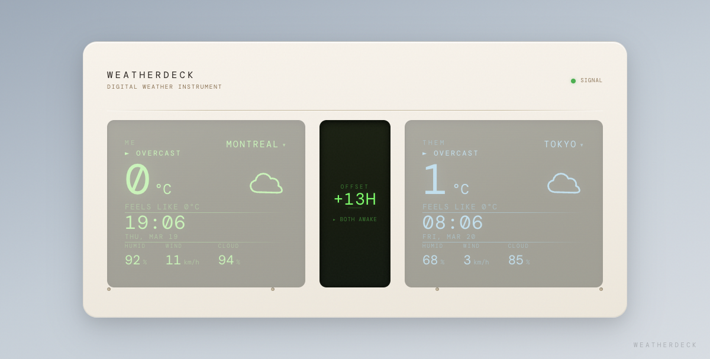

# WeatherDeck



**[Live Demo →](https://weatherdeck.b0th.com)**

A dual-city weather clock for long-distance couples. Braun T3-inspired design — two LCD screens showing real-time weather and clocks for two cities, with a time offset indicator in between.

## What is this?

You're in Montreal, they're in Tokyo. What's the weather like over there? Are they asleep? WeatherDeck answers these questions at a glance — styled as a Dieter Rams instrument, not another weather card.

## Features

- **Dual LCD screens** — ME (green) and THEM (blue), each with live weather + clock
- **Time offset indicator** — Shows hour difference and status (BOTH AWAKE / THEY'RE SLEEPING)
- **City selector** — Click city name to switch between 8 world cities
- **Line-drawn weather icons** — SVG icons in LCD color, no emoji
- **Responsive** — Desktop: side-by-side. Mobile: full-screen vertical stack
- **Live weather data** — Open-Meteo API (free, no key), server-side 10-min cache
- **Skeuomorphic design** — Cream plastic casing, recessed LCD, scanlines, glass reflection

## Tech Stack

| Layer | Tech |
|-------|------|
| Frontend | React 18 + Vite + Tailwind CSS v4 |
| Animation | GSAP (LCD flicker, temperature roll) |
| Data | Open-Meteo API (free, no API key) |
| Backend | Express.js (proxy + cache) |
| Fonts | Share Tech Mono, Bebas Neue, DM Mono |

## Cities

Montreal · Toronto · Vancouver · Tokyo · New York · London · Beijing · Paris

## Run Locally

```bash
# Backend
cd server && npm install && node index.js &

# Frontend
npm install && npm run dev -- --host --port 5173
```

Open `http://localhost:5173`

## Design

Inspired by Braun T3 Radio (1958) and Dieter Rams' "less, but better" philosophy. Every element serves the instrument metaphor — this is a weather *device*, not an app.

## License

MIT
